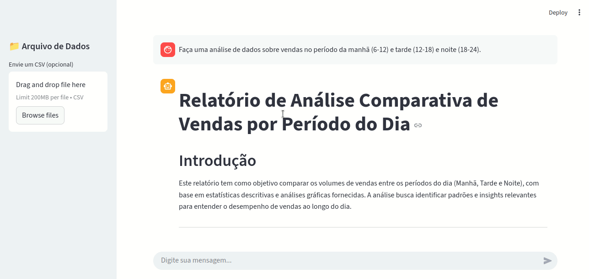

# Databot

Pacote Python para análise de dados de vendas, geração de gráficos SQL e visualização de grafos usando LangGraph e Ollama.  



---


## 🚀 Funcionalidades principais

- Geração de grafos LangGraph: `databot`, `analysis`, `sql`  
- Visualização de grafos em PNG usando `draw_mermaid_png()`  
- Integração com SQLAlchemy e PyMySQL para consultas de dados  
- Geração de gráficos com Matplotlib e Seaborn  
- Configuração via arquivo `.env`  

---

## 📥 Pré-requisitos

- Python 3.10 ou superior  

---

## 💾 Instalação em Linux

1. **Clone o repositório**:

```bash
git clone https://github.com/FelipeOliveira456/databot.git
cd databot
```

2. **Crie e ative um ambiente virtual e ative-o**:

```bash
python -m venv venv
source venv/bin/activate
```

3. **Instale o Poetry e as dependências**:

```bash
pip install poetry
poetry install
```

4. **Crie e configure o arquivo .env**:

```bash
touch .env
echo "MYSQL_USER=<seu_usuario>" >> .env
echo "MYSQL_PASSWORD=<sua_senha>" >> .env
echo "MYSQL_HOST=<seu_host>" >> .env
echo "MYSQL_PORT=<sua_porta>" >> .env
echo "MYSQL_DB=<seu_banco>" >> .env
```

💡 *Explicação do `.env`*

- Cada comando `echo` adiciona uma linha ao arquivo `.env`.  
- Substitua os placeholders pelos valores corretos do seu banco de dados:  
  - `<seu_usuario>` → usuário MySQL  
  - `<sua_senha>` → senha do usuário  
  - `<seu_host>` → endereço do servidor MySQL (ex: `localhost`)  
  - `<sua_porta>` → porta do MySQL (normalmente `3306`)  
  - `<seu_banco>` → nome do banco de dados a ser usado  

- O Databot lê automaticamente essas variáveis via **python-dotenv**, permitindo configurar o banco ou outras opções sem alterar o código.

5. **Instale e configure o Ollama**

O Databot depende do **Ollama** para executar os modelos LLM localmente.  

```bash
curl -fsSL https://ollama.com/install.sh | sh
ollama pull qwen3:32b
ollama pull qwen3-coder:30b
ollama pull qwen2.5vl:32b
```

💡 *Observação sobre modelos e recursos de GPU*

Os modelos recomendados (`qwen3:32b`, `qwen3-coder:30b`, `qwen2.5vl:32b`, `gpt-oss:20b`) foram pensados para execução em uma **GPU de 24GB**.  

Você pode escolher **modelos maiores ou menores** dependendo do seu poder computacional, mas lembre-se:  
- Modelos maiores exigem mais memória e podem não rodar em GPUs menores.  
- Modelos diferentes exigirão atualização dos arquivos dentro da pasta `agent/` para que os agentes usem os nomes corretos.

## 🚀 Rodando o aplicativo via Streamlit

Após instalar todas as dependências e configurar o `.env` e o Ollama, você pode iniciar a interface web do Databot com o Streamlit:

```bash
streamlit run app.py
```

💡 *Observações:*

- Por padrão, o Streamlit abrirá o aplicativo no navegador apontando para `http://localhost:8501`.  
- Certifique-se de que nenhuma outra aplicação esteja usando essa porta.  
- Se necessário, você pode definir outra porta com a opção `--server.port`.  
- O aplicativo se conectará automaticamente às configurações do seu `.env` e aos modelos do Ollama.

## 🖼️ Funcionalidades do Databot

O Databot possui três modos principais de operação na interface Streamlit:

1. **Anexar um CSV e fazer um pedido sobre os dados**  
   - O usuário envia um arquivo CSV e faz uma pergunta sobre os dados.  
   - Nesse caso, **o subgrafo SQL não é executado**, apenas o subgrafo de análise processa o CSV.  
   - Entregas do Databot:  
     - **Mensagem de resposta**  
     - **PDF** com relatório da análise

2. **Fazer um pedido solicitando apenas um CSV**  
   - O usuário pede apenas os dados resultantes de uma consulta.  
   - O Databot executa apenas o **subgrafo de consulta SQL**.  
   - Entregas do Databot:  
     - **CSV** com os dados solicitados

3. **Fazer um pedido solicitando análise, gráfico ou relatório**  
   - O usuário solicita uma análise ou visualização.  
   - O Databot executa **subgrafo de consulta SQL + subgrafo de análise**.  
   - Entregas do Databot:  
     - **Mensagem de resposta**  
     - **CSV** com os dados processados  
     - **PDF** com relatório e gráficos


## 📁 Estrutura de diretórios do Databot

O projeto Databot está organizado da seguinte forma:

```bash
databot
├── assets
├── databot
│   ├── agents
│   ├── data
│   │   ├── csv
│   │   ├── pdf
│   │   └── plots
│   ├── graph
│   │   └── subgraphs
│   │       ├── analysis
│   │       └── sql
│   ├── schemas
│   ├── sql
│   └── tools
└── tests
    ├── agentic
    ├── analyst
    │   └── data
    │       ├── csv
    │       ├── img
    │       └── pdf
    ├── complete
    │   └── data
    │       ├── csv
    │       ├── img
    │       └── pdf
    └── sql
```

### Explicação dos diretórios principais:

- **assets**: imagens, prints e outros arquivos estáticos usados no README ou documentação.  

- **databot/**: código-fonte principal do projeto.
  - **agents/**: agentes responsáveis por processar solicitações; são as *instanciações das LLMs do Ollama*. Cada arquivo contém as configurações do agente, como *system prompt*, *temperatura*, *janela de contexto* e outras definições específicas para o funcionamento do agente.  
  - **data/**: armazenamento de arquivos gerados ou usados pelo Databot.
    - **csv/**: arquivos CSV de entrada ou saída.  
    - **pdf/**: relatórios em PDF gerados pelo Databot.  
    - **plots/**: gráficos gerados com Matplotlib ou Seaborn.  
  - **graph/**: grafos LangGraph do projeto.
    - **subgraphs/**: subgrafos específicos:
      - **analysis/**: subgrafo de análise de dados.  
      - **sql/**: subgrafo de consultas SQL.  
  - **schemas/**: schemas de validação de dados ou modelos Pydantic.  
  - **sql/**: conexão com banco de dados MySQL.  
  - **tools/**: funções auxiliares utilizadas pelos agentes incluindo ferramentas como interpretador Python, consultas MySQL, gerador de PDFs, entre outros recursos.

- **tests/**: testes automatizados do projeto.
  - **agentic/**: testes relacionados aos agentes.  
  - **analyst/**: testes do subgrafo de análise, incluindo dados (`csv`, `img`, `pdf`).  
  - **complete/**: testes completos integrando análise, SQL e outputs.  
  - **sql/**: testes específicos do subgrafo de SQL.  

💡 **Observações adicionais:**

- Os subdiretórios dentro de **tests/** contêm explicações detalhadas sobre a execução dos testes.  
- O diretório **databot/graph/** e os subdiretórios **databot/graph/subgraphs/analysis** e **databot/graph/subgraphs/sql** trazem explicações sobre o fluxo dos grafos, mostrando como o grafo completo, subgrafos de análise e SQL funcionam e se integram aos agentes, respectivamente.
