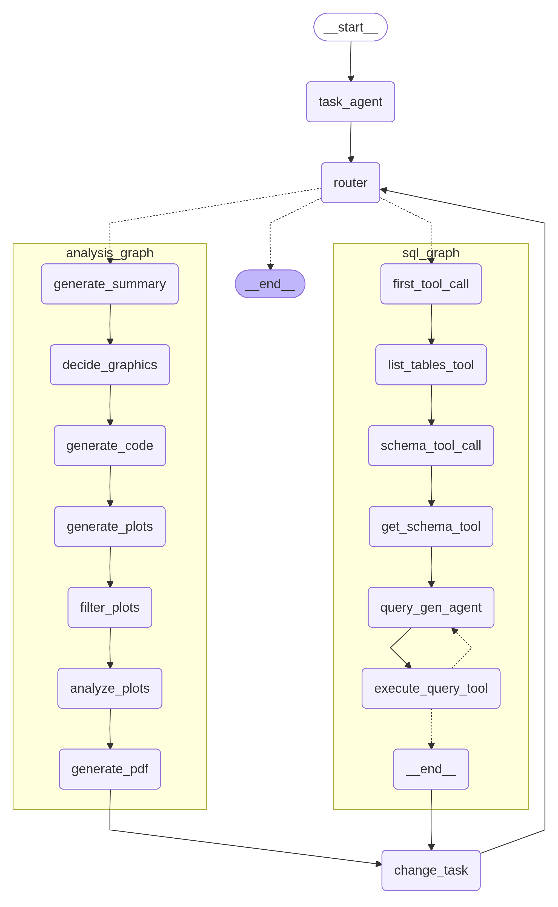

## 🖼️ Grafo do Databot

O grafo do **Databot** organiza o fluxo de execução das tarefas a partir de um pedido do usuário.

---

### Divisão em tasks

- **Nó `task_agent`**
  - É o nó central que **divide o pedido em tasks**, onde cada task contém:
    - Um **subgrafo** correspondente (`sql` ou `analysis`) que será executado.
    - Uma **descrição textual** do que a task deve fazer.
  - Essa divisão permite que o Databot processe pedidos complexos de forma estruturada e modular.

- **Pedidos sem sentido ou fora de escopo**
  - Caso a pergunta seja **inválida, ambígua ou fora do escopo** do sistema, o fluxo é redirecionado para o nó **`__end__`**.
  - A descrição dessa task contém uma **mensagem ao usuário**, informando que o pedido não pôde ser atendido e explicando o motivo (por exemplo: fora de escopo).

---

### Transição e Controle de Fluxo

Após a execução de um **subgrafo** (`sql_graph` ou `analysis_graph`), o fluxo converge para o nó **`change_task`**.

- **Nó `change_task`**
  - Este nó é responsável por **gerenciar o estado** da execução.
  - Ele **retira a tarefa atual** da lista de tarefas pendentes.
  - Em seguida, **pega a próxima tarefa** a ser executada e a envia de volta ao **`router`**.

- **Nó `router`**
  - Recebe a próxima tarefa do `change_task`.
  - É o responsável por **direcionar a execução** para o subgrafo correto (`sql_graph` ou `analysis_graph`), conforme definido na tarefa.

O ciclo se repete: **`router`** $\rightarrow$ **`subgrafo`** $\rightarrow$ **`change_task`** $\rightarrow$ **`router`**. A execução continua nesse loop até que todas as tarefas geradas pelo `task_agent` tenham sido processadas.