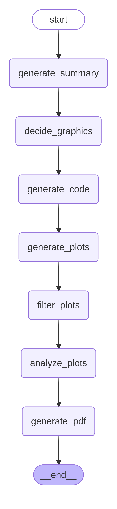

## 📈 Subgrafo `analysis_graph`

O `analysis_graph` é o módulo responsável por **transformar os dados brutos** (obtidos pelo `sql_graph` ou fornecidos inicialmente) em *insights* visuais e textuais, culminando na entrega de um relatório final.

---

### Fluxo de Análise e Geração de Relatório

1.  **`generate_summary`**
    * Inicia a Análise Exploratória de Dados (**AED**).
    * Gera um resumo estatístico abrangente dos dados:
        * **Valores Numéricos:** Máximo, mínimo, média, mediana, desvio padrão, etc.
        * **Valores Categóricos:** Contagem de categorias, valores mais frequentes, etc.

2.  **`decide_graphics`**
    * Este é um nó de decisão/planejamento.
    * Com base na AED, ele **decide quais gráficos serão mais relevantes** para visualizar os *insights*.
    * **Não executa código**, apenas define o plano, por exemplo: "Gráfico de barras da distribuição de produtos por categoria", "Gráfico de linha da evolução de vendas ao longo do tempo".

3.  **`generate_code`**
    * Recebe a lista de gráficos planejados.
    * **Gera o código Python** necessário para criar esses gráficos, utilizando bibliotecas como **Matplotlib** e **Seaborn**.

4.  **`generate_plots`**
    * É a *tool* que **executa o código Python** gerado.
    * Salva os arquivos de imagem (os *plots*) resultantes da execução.

5.  **`filter_plots`**
    * **Visualiza cada gráfico gerado**.
    * Avalia a qualidade, clareza e relevância de cada *plot*.
    * **Elimina** gráficos ruins, confusos ou redundantes, garantindo que apenas os melhores *assets* sigam para o relatório final.

6.  **`analyze_plots`**
    * Analisa cada *plot* que foi aprovado pelo filtro.
    * Gera uma explicação textual para cada gráfico. Exemplo: "O gráfico de barras indica que o maior pico de compras ocorre no período da tarde, entre 14h e 16h..."

7.  **`generate_pdf`**
    * O nó final que **estrutura e compila o relatório**.
    * Combina a análise estatística inicial (`generate_summary`), os *plots* filtrados e as explicações/insights gerados (`analyze_plots`).
    * Gera um arquivo **PDF** final e formatado para o usuário.
