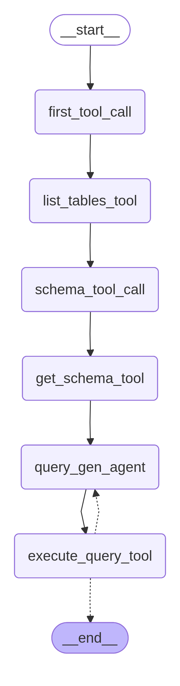

## 📊 Subgrafo `sql_graph`

O `sql_graph` é o módulo responsável por **interagir com o banco de dados** para obter dados necessários para as tarefas. Seu objetivo principal é traduzir a necessidade da tarefa em uma consulta SQL válida e executá-la.

---

### Fluxo de Execução

1.  **`first_tool_call`**
    * Inicia o processo chamando a **`list_tables_tool`**, o primeiro passo para entender o ambiente do banco de dados.

2.  **`list_tables_tool`**
    * Recupera e lista todos os nomes de tabelas disponíveis no banco de dados. Essa informação é essencial para o passo seguinte.

3.  **`schema_tool_call`**
    * Utiliza as tabelas listadas para chamar a **`get_schema_tool`**.

4.  **`get_schema_tool`**
    * Recupera o **esquema (schema)** completo do banco de dados (nomes de colunas, tipos de dados, etc.) para as tabelas relevantes. Este é o insumo fundamental para a geração da consulta SQL.

5.  **`query_gen_agent`**
    * É o **agente inteligente** que recebe a descrição da tarefa e o esquema do banco de dados.
    * Sua função é gerar o **código SQL** correspondente à tarefa.

6.  **`execute_query_tool`**
    * Recebe o código SQL gerado e tenta executá-lo no banco de dados.

---

### Mecanismo de Correção

O `sql_graph` possui um mecanismo de *feedback* e correção para garantir a validade do código SQL:

* **Em caso de erro:** Se a execução resultar em um **erro de sintaxe, lógica ou de esquema**, o fluxo retorna (linha pontilhada) para o **`query_gen_agent`**. O agente recebe a mensagem de erro e o contexto anterior para gerar uma **nova versão** corrigida da consulta SQL.
* **Em caso de sucesso:** Se a consulta for executada com sucesso, o fluxo segue para o nó **`__end__`**, finalizando o subgrafo SQL e retornando os dados obtidos para o fluxo principal.